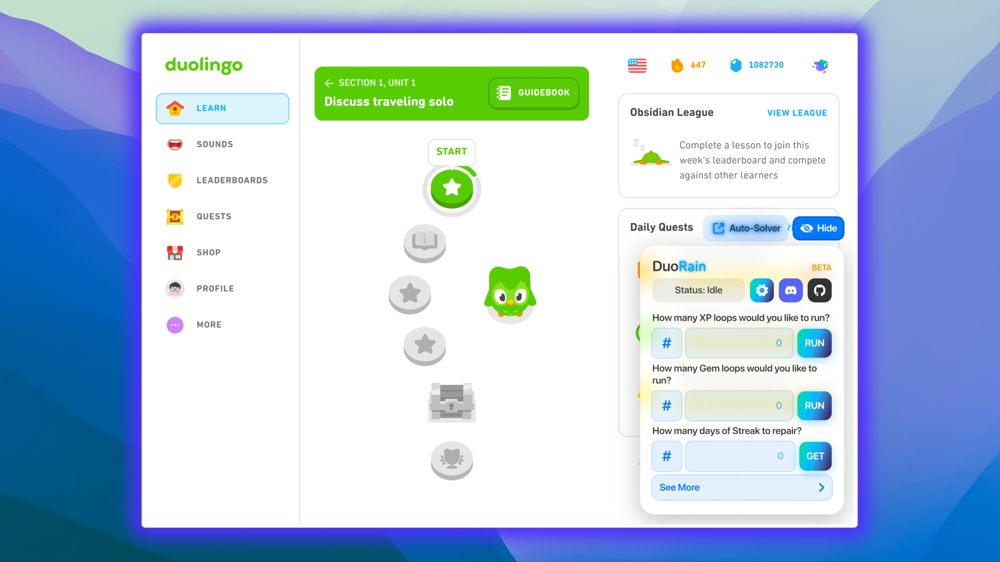
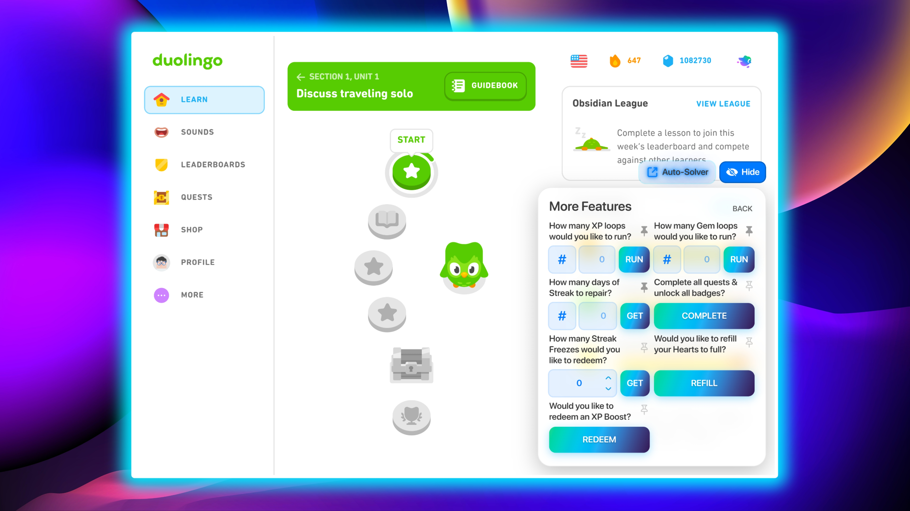
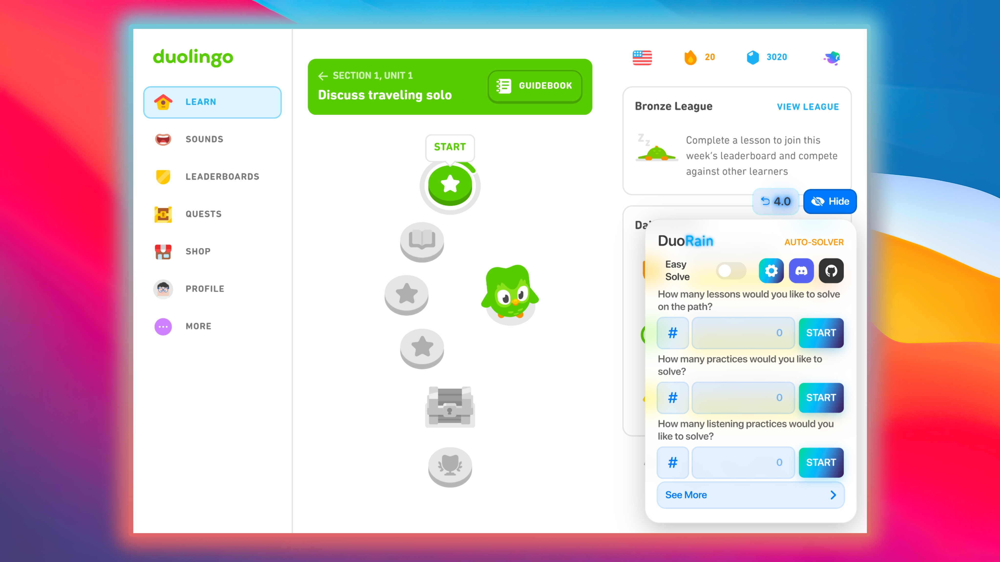
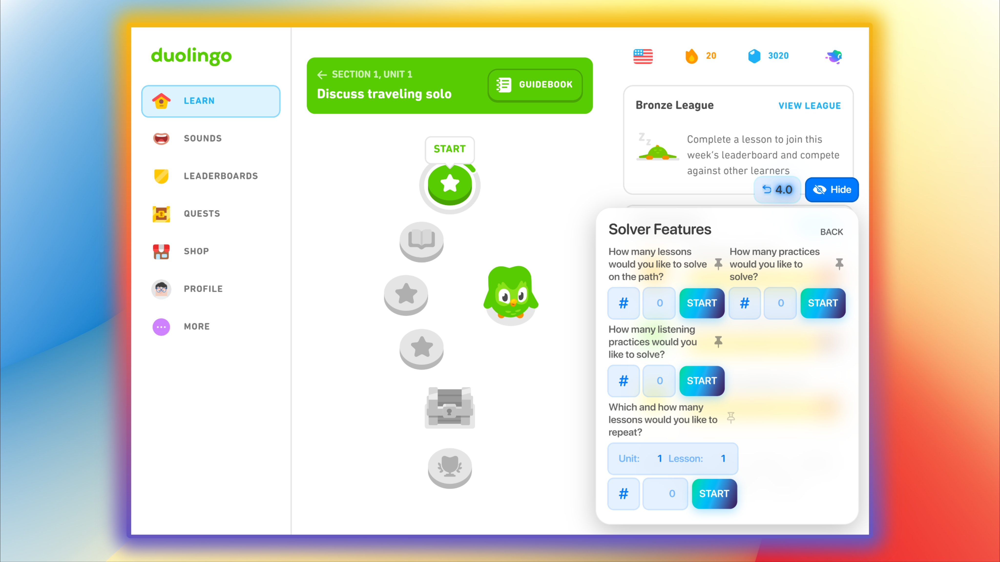

# 🌪️ DuoRain 🌪️
> **v4.0 BETA** - *An Open-Source Tampermonkey/Greasemonkey userscript that automates Duolingo XP, Gems, Streaks, Quests, and Lessons.*

---

## ✨ Farming Features

- 📈 **XP Farming** — Automate XP gain.
> *~499 XP per loop.*

- 💎 **Gem Farming** — Automate Gem acquisition.
> *~120 Gems per loop.*

- 🔥 **Streak Farming** — Farm/Repair Streaks.
> *Set the number of days you need to repair/farm.*

- 🎯 **Quest & Badge Unlocker** — Completes all of your past monthly quests and current daily and monthly quests.
> *This feature grants you all the monthly quest badges you've missed and complete your current daily and monthly quests.*

---

## 🤖 Auto-Solver

> *The Auto-Solver automatically completes various types of lessons and practices for you. It features two main components:*

- 🧩 **Easy Solve** — Solve any lesson by solving one easy challenge and it can solve stories, lessons, legendary lessons and audio lessons.
- 🖱️ **Auto-Clicker** — Automatically clicks through the simplified lessons, requiring no user interaction.

**Supported Modes:**
- **Path Solver**: Completes lessons directly on your learning path.(this is buggy and will be fixed in next update)
- **Practice Solver**: Solves exercises from the Practice Hub.(this is buggy and will be fixed in next update)
- **Listening Solver**: Completes listening practices.(this is buggy and will be fixed in next update)
- **Specific Lesson Solver**: Repeats and solves a specific lesson from any unit you choose.(this is buggy and will be fixed in next update)

---

## ⚡ Utilities

- ❤️ **Refill Hearts** — Instantly refill your hearts to full.
- ❄️ **Get Streak Freeze** — Redeem up to 3 Streak Freezes at a time.
- 🚀 **Redeem XP Boost** — Activate XP Boosts Instantly.

---

## 🖼️ Images

  

  

  

  

---

## 🛠️ Requirements

- 🧩 Extension: [Tampermonkey](https://www.tampermonkey.net/) or [Greasemonkey](https://www.greasespot.net/)

---

## 📥 Installation

1. Install a userscript manager.
2. Click [DuoRain-BETA.user.js](https://raw.githubusercontent.com/OracleMythix/DuoRain-BETA/main/DuoRain-BETA.user.js) or Install from [GreasyFork](https://greasyfork.org/en/scripts/547811-duorain-beta).
3. Confirm installation in your userscript manager.
4. Visit [Duolingo](https://www.duolingo.com).

---

## ⚠️ Disclaimer

- ❌ This project is **not affiliated with or endorsed by Duolingo**.
- ⚠️ For educational and experimental purposes only. Use at your own risk.

---

## 👤 Author

- [OracleMythix](https://github.com/OracleMythix)
- 📦 Repository: [DuoRain-BETA](https://github.com/OracleMythix/DuoRain-BETA)
